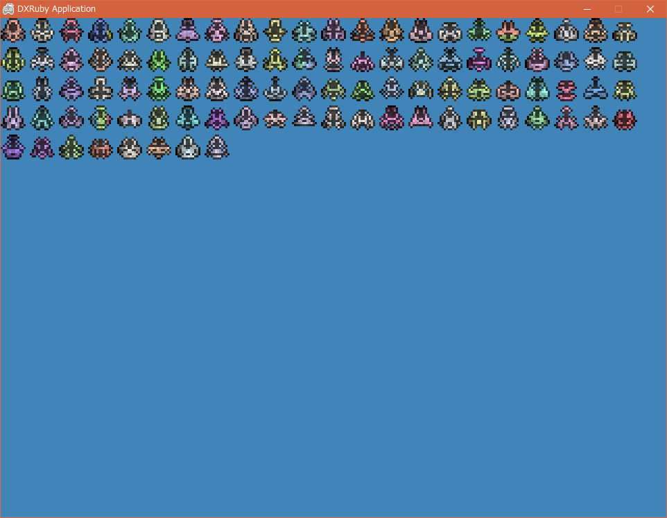
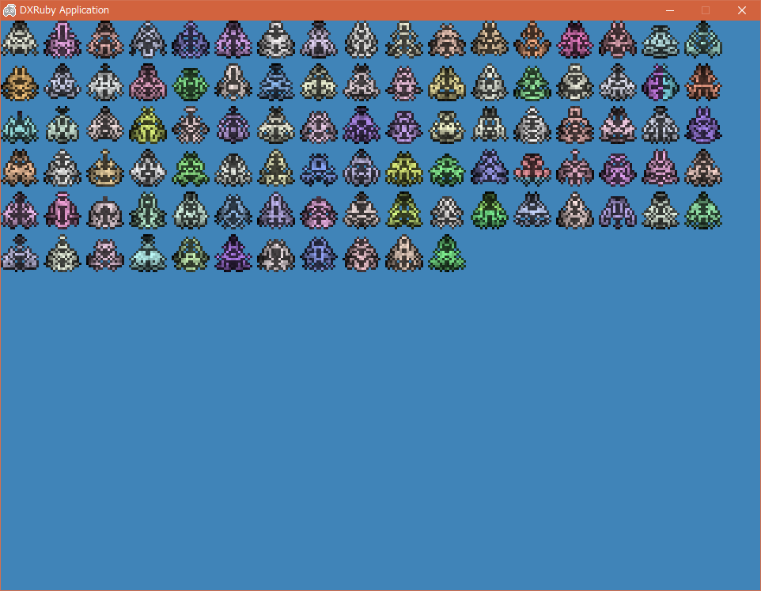
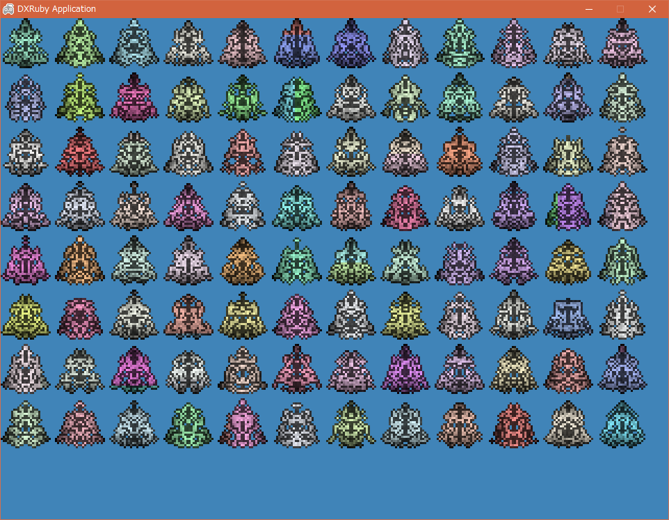

tinypixelspritegenerator
========================

ドット絵を自動生成するRubyスクリプト

Description
-----------

[zfedoran/pixel-sprite-generator](https://github.com/zfedoran/pixel-sprite-generator) を Ruby で移植。

Screenshot
----------

DXRuby を使ってテスト表示。3倍に拡大表示。

Requirement
-----------

Ruby 2.2以上。

Usage
-----

    require_relative 'tinypixelspritegenerator'

    mask_spaceship = [
      # 12x12
      # "0" or " " = empty
      # "1" or "." = Randomly chosen Empty/Body
      # "2" or "+" = Randomly chosen Border/Body
      # "3" or "*" = Always border (black)
      '000000',
      '000011',
      '000013',
      '000113',
      '000113',
      '001113',
      '011122',
      '011122',
      '011122',
      '011113',
      '000111',
      '000000',
    ]

    # convert mask array
    mask = TinyPixelSpriteGenerator.convert_mask(mask_spaceship)

    # generate pixels array
    p = TinyPixelSpriteGenerator.new(
      mask,
      mirror_x: true,
      mirror_y: false,
      colored: true,
      edgebrightness: 0.3,
      colorvariations: 0.2,
      brightnessnoise: 0.3,
      saturation: 0.5,
      seed: rand(65536)
    )

    pp p.pixel_data

Licence
-------

MIT License

(JavaScript で書かれたオリジナル版が MIT License だったので合わせておきます。)

Author
------

mieki256

original by [zfedoran](https://github.com/zfedoran)
